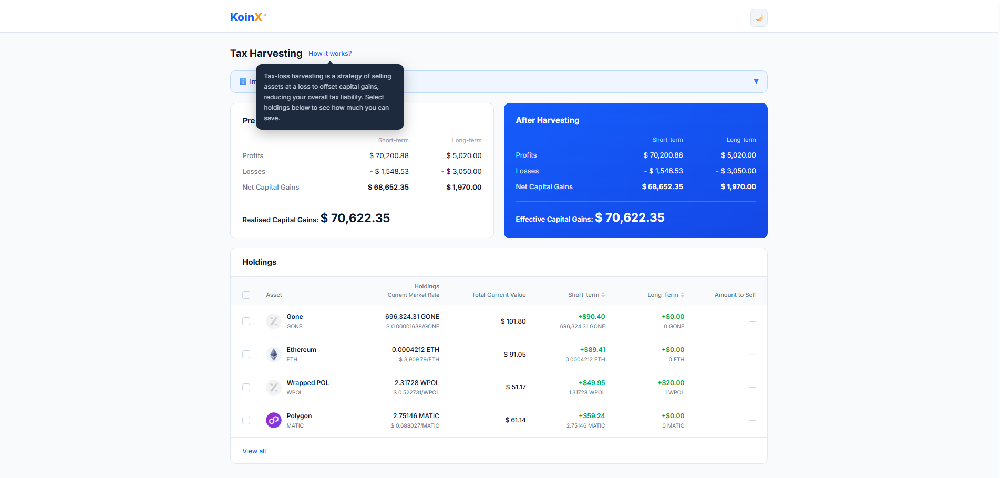
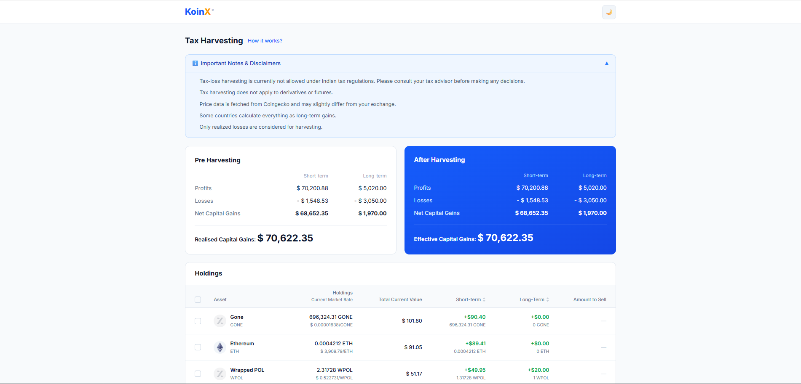
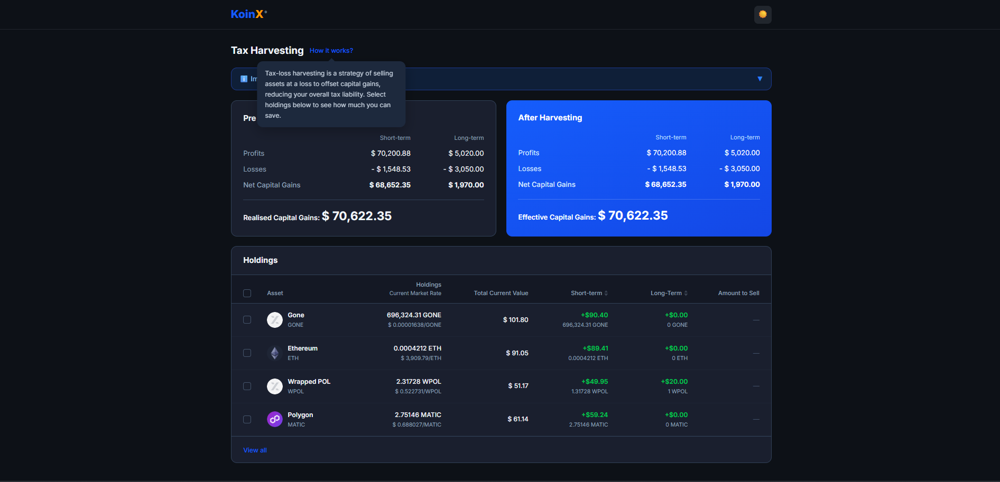
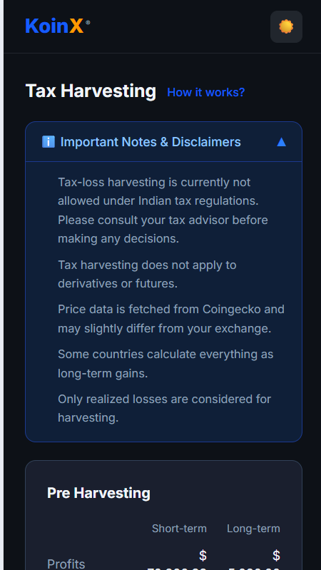
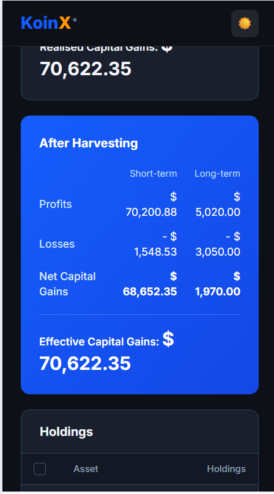

#  KoinX - Crypto Dashboard

##  Live Demo

 https://koinx-5kwq.vercel.app/

##  GitHub Repository

 https://github.com/kishanganesh07/Koinx

---

## About the Project

KoinX is a responsive cryptocurrency dashboard that displays real-time data such as prices, charts, and market trends. It helps users track crypto performance in a simple and user-friendly interface.

---

##  Features

*  Real-time cryptocurrency data
*  Interactive charts
*  Search functionality
*  Fully responsive design
*  Fast and optimized UI

---

##  Tech Stack

* Frontend: React.js
* Styling: CSS / Tailwind (if used, adjust)
* API: Crypto API (CoinGecko or relevant API)
* Deployment: Vercel

---

##  Folder Structure

```
Koinx/
│── koinx-react/        # Main frontend application
│   │── public/         # Static files
│   │── src/            # Source code
│   │   │── components/ # Reusable UI components
│   │   │── pages/      # Page-level components
│   │   │── assets/     # Images, icons, etc.
│   │   │── services/   # API calls
│   │   │── utils/      # Helper functions
│   │   │── App.js      # Main app component
│   │   │── index.js    # Entry point
│   │── package.json    # Dependencies
│── README.md           # Project documentation

---

##  Installation & Setup

1. Clone the repository:

```
git clone https://github.com/kishanganesh07/Koinx.git
```

2. Navigate to project:

```
cd Koinx/koinx-react
```

3. Install dependencies:

```
npm install
```

4. Run the app:

```
npm start
```

---

##  Screenshots










---

##  Future Improvements

*  Add alerts for price changes
*  Multi-language support
*  More detailed analytics

---
